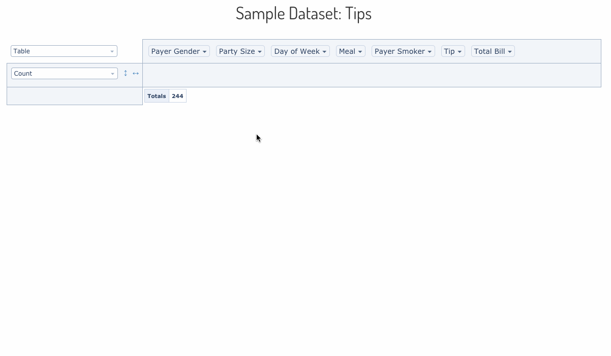

# react-pivottable

`react-pivottable` is a React-based pivot table library with drag'n'drop
functionality. It is a React port of the jQuery-based.


`react-pivottable` is part of Plotly's [React Component Suite](https://plot.ly/products/react/) for building data visualization Web apps and products.

## What does it do & where is the demo?

`react-pivottable`'s function is to enable data exploration and analysis by
summarizing a data set into table or [Plotly.js](https://plot.ly/javascript/)
chart with a true 2-d drag'n'drop UI, very similar to the one found in older
versions of Microsoft Excel.




## How can I use it in my project?

### Drag'n'drop UI with Table output only

Installation is via NPM and has a peer dependency on React:

```
npm install --save react-pivottable react react-dom
```

Basic usage is as follows. Note that `PivotTableUI` is a "dumb component" that
maintains essentially no state of its own.

```js
import React from 'react';
import ReactDOM from 'react-dom';
import PivotTableUI from 'react-pivottable/PivotTableUI';
import 'react-pivottable/pivottable.css';

// see documentation for supported input formats
const data = [['attribute', 'attribute2'], ['value1', 'value2']];

class App extends React.Component {
    constructor(props) {
        super(props);
        this.state = props;
    }

    render() {
        return (
            <PivotTableUI
                data={data}
                onChange={s => this.setState(s)}
                {...this.state}
            />
        );
    }
}

ReactDOM.render(<App />, document.body);
```

### Drag'n'drop UI with Plotly charts as well as Table output

The Plotly `react-plotly.js` component can be passed in via dependency
injection. It has a peer dependency on `plotly.js`.

**Important:** If you build your project using webpack, you'll have to follow
[these instructions]
in order to successfully bundle `plotly.js`. See below for how to avoid having
to bundle `plotly.js`.

```
npm install --save react-pivottable react-plotly.js plotly.js react react-dom
```

To add the Plotly renderers to your app, you can use the following pattern:

```js
import React from 'react';
import PivotTableUI from 'react-pivottable/PivotTableUI';
import 'react-pivottable/pivottable.css';
import TableRenderers from 'react-pivottable/TableRenderers';
import Plot from 'react-plotly.js';
import createPlotlyRenderers from 'react-pivottable/PlotlyRenderers';

// create Plotly renderers via dependency injection
const PlotlyRenderers = createPlotlyRenderers(Plot);

// see documentation for supported input formats
const data = [['attribute', 'attribute2'], ['value1', 'value2']];

class App extends React.Component {
    constructor(props) {
        super(props);
        this.state = props;
    }

    render() {
        return (
            <PivotTableUI
                data={data}
                onChange={s => this.setState(s)}
                renderers={Object.assign({}, TableRenderers, PlotlyRenderers)}
                {...this.state}
            />
        );
    }
}

ReactDOM.render(<App />, document.body);
```

#### With external `plotly.js`

If you would rather not install and bundle `plotly.js` but rather get it into
your app via something like `<script>` tag, you can ignore `react-plotly.js`'
peer-dependcy warning and handle the dependency injection like this:

```js
import React from 'react';
import PivotTableUI from 'react-pivottable/PivotTableUI';
import 'react-pivottable/pivottable.css';
import TableRenderers from 'react-pivottable/TableRenderers';
import createPlotlyComponent from 'react-plotly.js/factory';
import createPlotlyRenderers from 'react-pivottable/PlotlyRenderers';

// create Plotly React component via dependency injection
const Plot = createPlotlyComponent(window.Plotly);

// create Plotly renderers via dependency injection
const PlotlyRenderers = createPlotlyRenderers(Plot);

// see documentation for supported input formats
const data = [['attribute', 'attribute2'], ['value1', 'value2']];

class App extends React.Component {
    constructor(props) {
        super(props);
        this.state = props;
    }

    render() {
        return (
            <PivotTableUI
                data={data}
                onChange={s => this.setState(s)}
                renderers={Object.assign({}, TableRenderers, PlotlyRenderers)}
                {...this.state}
            />
        );
    }
}

ReactDOM.render(<App />, document.body);
```

## Properties and layered architecture

* `<PivotTableUI {...props} />`
  * `<PivotTable {...props} />`
    * `<Renderer {...props} />`
      * `PivotData(props)`

The interactive component provided by `react-pivottable` is `PivotTableUI`, but
output rendering is delegated to the non-interactive `PivotTable` component,
which accepts a subset of its properties. `PivotTable` can be invoked directly
and is useful for outputting non-interactive saved snapshots of `PivotTableUI`
configurations. `PivotTable` in turn delegates to a specific renderer component,
such as the default `TableRenderer`, which accepts a subset of the same
properties. Finally, most renderers will create non-React `PivotData` object to
handle the actual computations, which also accepts a subset of the same props as
the rest of the stack.

Here is a table of the properties accepted by this stack, including an
indication of which layer consumes each, from the bottom up:


### Accepted formats for `data`

#### Arrays of objects

One object per record, the object's keys are the attribute names.

_Note_: missing attributes or attributes with a value of `null` are treated as
if the value was the string `"null"`.

```js
const data = [
    {
        attr1: 'value1_attr1',
        attr2: 'value1_attr2',
        //...
    },
    {
        attr1: 'value2_attr1',
        attr2: 'value2_attr2',
        //...
    },
    //...
];
```

#### Arrays of arrays

One sub-array per record, the first sub-array contains the attribute names. If
subsequent sub-arrays are shorter than the first one, the trailing values are
treated as if they contained the string value `"null"`. If subsequent sub-arrays
are longer than the first one, excess values are ignored. This format is
compatible with the output of CSV parsing libraries like PapaParse.

```js
const data = [
    ['attr1', 'attr2'],
    ['value1_attr1', 'value1_attr2'],
    ['value2_attr1', 'value2_attr2'],
    //...
];
```

#### Functions that call back

The function will be called with a callback that takes an object as a parameter.

_Note_: missing attributes or attributes with a value of `null` are treated as
if the value was the string `"null"`.

```js
const data = function(callback) {
    callback({
        "attr1": "value1_attr1",
        "attr2": "value1_attr2",
        //...
    });
    callback({
        "attr1": "value2_attr1",
        "attr2": "value2_attr2",
        //...
    };
    //...
};
```
